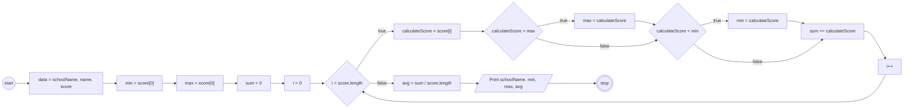

# JavaScript4

## Program Hitung Nilai

### Flowchart

```mermaid
flowchart LR
    A((start))
    B["data = schoolName, name, score"]
    C["min = score[0]"]
    D["max = score[0]"]
    E["sum = 0"]
    F["i = 0"]
    G{"i < score.length"}
    H["calculateScore = score[i]"]
    I{"calculateScore > max"}
    J["max = calculateScore"]
    K{"calculateScore < min"}
    L["min = calculateScore"]
    M["sum += calculateScore"]
    N["i++"]
    O["avg = sum / score.length"]
    P[/Print schoolName, min, max, avg/]
    Z(((stop)))

    A --> B
    B --> C
    C --> D
    D --> E
    E --> F
    F --> G
    G -- true --> H
    H --> I
    I -- true --> J
    I -- false --> K
    J --> K
    K -- true --> L
    K -- false --> M
    L --> M
    M --> N
    N --> G
    G -- false --> O
    O --> P
    P --> Z
```